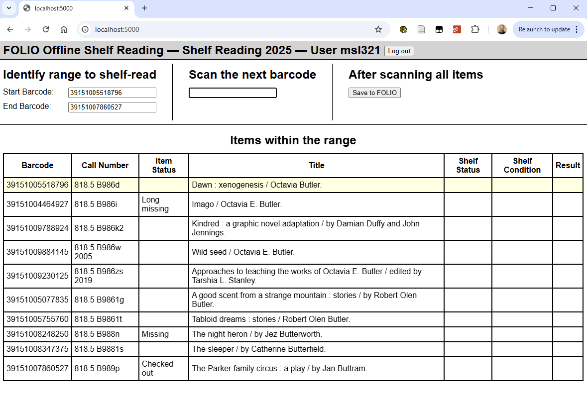

# FOLIO Offline Shelf Reading

A shelf-reading (inventory check) process for FOLIO items.  Using a laptop, a barcode scanner, and a cart.

## Design Goals

- Read one section at at time, with up-to-date inventory data (no pre-loading).
- Do the actual shelf-reading quickly, without looking at the laptop screen unless something goes wrong.
- Fix minor shelf order problems quickly, while recording bigger problems for later.
- Quickly record condition issues with no typing.
- Work without network traffic while in the stacks, so good Wi-Fi doesn't matter.
- Store (almost) all data in FOLIO to maintain a single source-of-truth.

## How it Works / Usage Example

### Step 1: Scan the start and end barcodes of a given range.  The items within the range are loaded.  

- Note that three items have a listed Item Status.  The item status is listed whenever it's not Available.  These items are in the expected call number range (and location) but should not be on the shelf.



### Step 2: Scan each item in order.  If an item has damage, scan a damage barcode as well.

- The Shelf Status of each scanned item is marked as "Present", except for the Missing item which was unexpectedly found on the shelf and marked accordingly as "Unavailable item is on shelf."

- Two scanned items were discovered to have condition issues, so a condition barcode was scanned right after the item barcode.  The Shelf Condition column lists the scanned condition of these items: "Major concern" or "Spine label needs replacement."


- When an item is scanned that falls within this range but should have been shelved before the previously scanned item, a popup alerts the user to fix the order.


- When an item is scanned that's out of the range entirely, the user is prompted to move it to a cart to figure out afterwards.


### Step 3: Click "Save to FOLIO" to save and mark the items as appropriate.

- The green background shows which rows were processed and results saved successfully to FOLIO.
- The Result column shows
    - "Saved" for the scanned items.
    - "Marked as missing" for the items not scanned.


In FOLIO: 

- The processed items are all marked with a statistical code recording the inventory cycle.


- An "Inventory" type item note records the shelf status, date/time and username of each item inventoried.
- For items with a scanned condition barcode, a second "Inventoried Condition" type item note records the condition.


Finally, an email is sent to a configured list of users, summarizing the results of shelf reading that range.

## Dependencies

- FOLIO
- MetaDB
- Python

## Configuration & Deployment

1. Create and configure `config.properties` based on [the example](./config/config.properties.example).
    - This includes creating FOLIO statistical codes and item note types as specified in the example file. 
1. Clone this repo.
1. Start docker.

```
git clone https://github.com/lehigh-university-libraries/folio-offline-shelf-reading
cd folio-offline-shelf-reading
# cp config/config.properties.example config/config.properties
# make edits to config/config.properties
docker run \
  -v ./:/app
  -p 8080:8080 \
  --rm \
  --name folio-offline-shelf-reading \
  ghcr.io/lehigh-university-libraries/folio-offline-shelf-reading:main
```

## Custom Shelving Order

In some cases, an item's FOLIO-generated shelving order field may not be sufficient to sort items correctly.  See for example [a constraint on Dewey cutter numbers](https://github.com/lehigh-university-libraries/folio-shelving-order?tab=readme-ov-file#non-standard-behavior).

If an item has a note of type `Shelving order`, the value in that field is interpreted as a local shelving order, and is used as a sorting value instead of the item's shelving order field.  The sort logic looks to both fields, so only those items that require a custom local shelving order field need that note defined.

The [FOLIO Update Local Shelving Order](https://github.com/lehigh-university-libraries/folio-update-local-shelving-order) tool adds these items notes to the relevant items, using [FOLIO Shelving Order](https://github.com/lehigh-university-libraries/folio-shelving-order) to generate the local shelving order.

## Attribution

- [Scanning beep sound effect](https://pixabay.com/sound-effects/beep-313342/) by [Musheran](https://pixabay.com/users/musheran-40634446/)
- [Error sound effect](https://pixabay.com/sound-effects/message-notification-103496/) by [freesound_community](https://pixabay.com/users/freesound_community-46691455/)
- Credit also to [Michelle Suranofksky](@suranofsky) for [Lehigh's initial Inventory app](https://github.com/folio-labs/google-sheets-addon/tree/master/lehigh-inventory).  We built this new solution to meet some different [design goals](#design-goals), and to take advantage of capabilities we didn't have back then ([Metadb](https://metadb.dev/doc/)!), but it would not have been possible without ideas and techniques from the initial approach.
